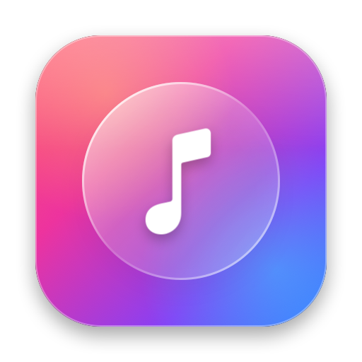

# GlassTunes

Liquid Glass music widgets for macOS 14 and later (built with Xcode 27 on macOS 27).
Works with **Apple Music, Spotify, YouTube Music (Chrome/Safari/Brave/Edge) and Sonos**.
Click any widget to open a floating Liquid Glass mini player with animated album art.

## Install

Download the latest **GlassTunes.dmg** from [Releases](https://github.com/Ebrahim-Alamoudi/Music-Widget-MacOs/releases/latest) and drag it into Applications. It needs macOS 14 Sonoma or later and runs on Apple Silicon and Intel. Liquid Glass appears on macOS 26 and later; older systems get a frosted-glass look.

This build isn't notarized yet. The first time you open it, go to **System Settings → Privacy & Security → Open Anyway**, or run:

```bash
xattr -dr com.apple.quarantine /Applications/GlassTunes.app
```

<p align="center"></p>

## The app

One window with native macOS controls, the system font and your accent color:

- **Now Playing (left):** animated artwork, a seek bar, controls, shuffle/repeat, volume, the AutoMix status, and your recent songs.
- **Settings (right):** where music comes from, the Sonos room, a widget preview for each glass style and size, and General options.
- **Up Next:** the list button shows the queue. That's the current album or playlist in Apple Music, the Sonos queue, or YouTube Music's Up Next. Click a song to play it. Spotify doesn't share its queue.
- **Menu Bar button (toolbar):** show the icon, the song title, or both, or remove GlassTunes from the menu bar.
- **Mini player:** a floating 340×156 panel on real Liquid Glass (`NSGlassEffectView`). Hover it to show the real window buttons (the green one opens the full player), the queue and the pin.
- **Full player:** a 380×700 glass panel in the style of Apple Music's full-screen player, with the same hover window buttons (green switches back to the mini player).
- **Playback menu:** ⌥Space play/pause, ⌘→ / ⌘← to skip, ⇧⌘S shuffle, ⇧⌘R repeat, ⇧⌘P mini player, ⇧⌘F full player.

It uses about 1% CPU and about 110 MB of memory when idle. Only the browser and Sonos sources are checked every 3 seconds; Music and Spotify announce their own changes. Closed player windows free their video and views.

## Sources

Pick one in the main window, the menu bar or the player.

- **Automatic** shows whatever is playing. When music plays both on this Mac and on Sonos, it shows the Mac.
- When several players have music loaded, the source icon on the widget (and a button on the mini player) switches between them.
- You can also choose Apple Music, Spotify, YouTube Music or a Sonos room directly.

- **YouTube Music** is controlled through its browser tab. Turn on *Allow JavaScript from Apple Events*: in Chrome, View → Developer; in Safari, Develop → Developer Settings. Firefox can't be scripted.
- **Sonos** speakers are found on your local network (SSDP) and controlled over their local API. You can also type a speaker's IP address.
- macOS asks once per app for Automation permission (Privacy & Security → Automation).

## Full player

- Animated album art comes from Apple Music's public album page. GlassTunes finds the album with the iTunes Search API, for any source.
- It shows an **AutoMix** or **Crossfade** badge when transitions are on (Apple Music settings, Sonos crossfade). When a song hands off to the next one shortly before its end, the player animates "Mixing into next song". No player reports AutoMix directly, so this is inferred.

## How it works

- `App/` — a menu bar helper app. `Sources/` has one adapter per player. `PlayerHub` chooses a source, saves the state and artwork into the shared App Group folder, and reloads the widgets.
- `Widget/` — the WidgetKit extension. It runs in a sandbox, so its buttons send Darwin notifications that the helper turns into Music commands.
- `Shared/` — the model, the button actions (App Intents) and the widget views. Both targets compile this folder.

If a Music track has no artwork it can read over AppleScript, the helper looks up the artwork with Apple's iTunes Search API.

## Build

Requires Xcode 27 and [XcodeGen](https://github.com/yonaskolb/XcodeGen) (`brew install xcodegen`). Set `DEVELOPMENT_TEAM` in `project.yml` to your own team ID.

```bash
xcodegen generate
xcodebuild -project GlassTunes.xcodeproj -scheme GlassTunes -configuration Release -derivedDataPath build -allowProvisioningUpdates build
ditto build/Build/Products/Release/GlassTunes.app /Applications/GlassTunes.app
open /Applications/GlassTunes.app
```

To build and install on this Mac, run `Scripts/install-local.sh`. It also removes Xcode's build copies from macOS's app registry; if those stay registered, desktop widgets can load an old copy or show up blank.

To package a release (`dist/GlassTunes-<version>.dmg`, `.zip` and checksums), run `Scripts/make-release.sh`.

To redraw the app icon, run `swift Scripts/make-icon.swift App/Assets.xcassets/AppIcon.appiconset`.

Signing uses the team in `project.yml` (`DEVELOPMENT_TEAM`). Keep GlassTunes running (turn on "Open at login") so the widgets stay up to date.
